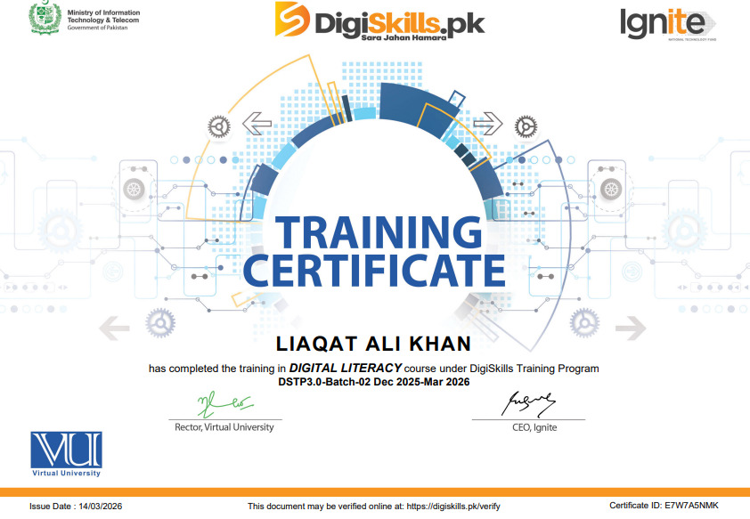
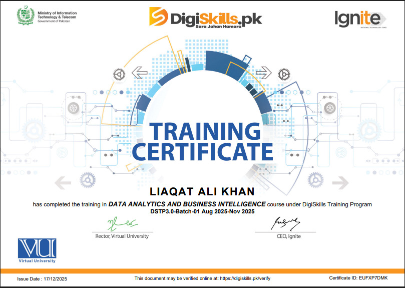

  
  
  

  
  
  
  
  

---

## 👨‍💼 About Me

I’m a **BS Data Science student** at **Virtual University of Pakistan** with a practical blend of:

- 📊 **Data Analysis** (Python, NumPy, Pandas, Matplotlib, Excel)  
- 🌐 **Web Design** (WordPress, Elementor Pro, responsive layouts)  
- 🚀 **Freelance execution** focused on business-ready digital outcomes  

I’m actively looking for **internship / entry-level opportunities (Remote/Hybrid)** where I can deliver real impact.

---

## 🧠 Core Skills

<table>
<tr>
<td width="50%" valign="center">

### 📈 Data Analytics

   
   
   
   
   
  

</td>
<td width="50%" valign="top">

### 🎨 Web Designing & Development

   
   
   
   
   
  

</td>
</tr>
</table>

---

## 🏅 Certifications

✅ Data Analytics & Business Intelligence — **DigiSkills.pk**  
✅ WordPress Development — **DigiSkills.pk**  
✅ Digital Literacy & Basic IT — **DigiSkills.pk**  
✅ Digital Literacy — **DigiSkills.pk** *(DSTP3.0-Batch-02, Dec 2025–Mar 2026, Issue Date: 14/03/2026, Certificate ID: E7W7A5NMK, Verify: https://digiskills.pk/verify)*  
✅ Data Analytics and Business Intelligence — **DigiSkills.pk** *(DSTP3.0-Batch-01, Aug 2025–Nov 2025, Issue Date: 17/12/2025, Certificate ID: EUFXP7DMK, Verify: https://digiskills.pk/verify)*  
✅ WordPress — **DigiSkills.pk** *(DSTP3.0-Batch-02, Dec 2025–Mar 2026, Issue Date: 14/03/2026, Certificate ID: UZD7DAWMK, Verify: https://digiskills.pk/verify)*

 

### 🖼️ Certification Proof

<table>
<tr>
<td width="33.33%" align="center" valign="top">

**Digital Literacy (DSTP3.0-Batch-02)**  

</td>
<td width="33.33%" align="center" valign="top">

**Data Analytics and Business Intelligence (DSTP3.0-Batch-01)**  

</td>
<td width="33.33%" align="center" valign="top">

**WordPress (DSTP3.0-Batch-02)**  

</td>
</tr>
</table>

---

## 💼 Portfolio Highlights

- WordPress Website Design 
- Conversion-focused landing pages  
- Professional WordPress business websites  
- User-focused and practical digital experiences  
- Premium Ecommerce Websites
- Blogging Websites
- UI & UX Design
- Data Cleaning Using Python & it's Library 

---

## 🛠️ Tools I Recommend

> These are platforms I recommend based on practical use cases.  
> *Some links below are sponsored links, meaning I may earn a commission at no extra cost to you.*

### 🌐 Hosting & Infrastructure

- **Hosting** — Comparing plans for blogs, business sites, and client projects — [Open](https://codeics.me/hosting)  
- **Kinsta** — Premium managed WordPress hosting (speed, security, backups) — [Open](https://codeics.me/kinsta)  
- **DigitalOcean** — Cloud servers for developers who need scalability and control — [Open](https://codeics.me/digital-ocean)

### 🧩 WordPress & Site Building

- **Elementor** — Drag-and-drop design for modern WordPress pages — [Open](https://codeics.me/elementor)  
- **SolidWP** — Security, backup, and management for WordPress sites — [Open](https://codeics.me/solidWP)  
- **LearnDash** — Building and selling online courses with WordPress LMS — [Open](https://codeics.me/learndash)

### 📌 Traffic & Marketing

- **Pinterest** — Long-term organic traffic for blogs and digital content — [Open](https://codeics.me/pinterest)

---

## 🎯 Current Focus

- Strengthening **Python for Data Science**
- Growing as a **Data Analyst**
- Building **high-value web and analytics solutions**
- Collaborating on practical projects with measurable outcomes

---

## 📬 Contact

  
  
  

---

### ⭐ Thank you for visiting my portfolio

**© 2026 Liaqat Ali Khan**

